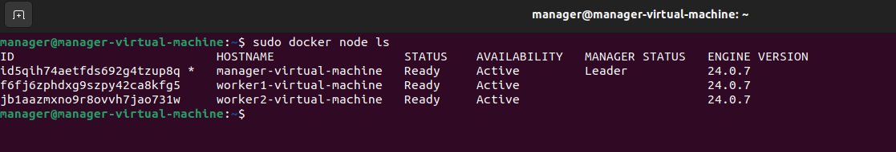
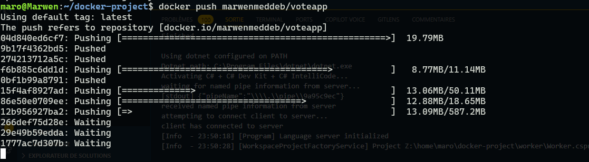
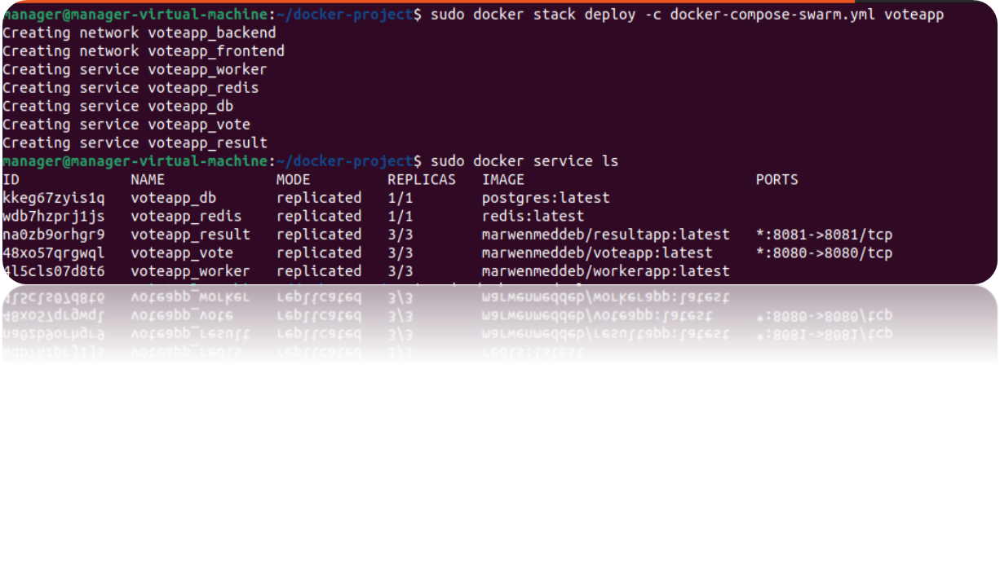

# Projet Docker Swarm - Application de Vote

- Ce projet consiste à containeriser une application de vote distribuée en utilisant Docker et à la déployer sur un cluster Docker Swarm.

## Architecture


   - vote : une application web Python qui permet de voter pour l'une des deux options.

   - worker : un service .NET qui consomme les votes depuis une instance Redis et les stocke dans une base de données PostgreSQL.

   - result : une application web Node.js qui affiche les résultats du vote en temps réel.

   - Une instance de PostgreSQL pour stocker les votes.

   - Une instance de Redis pour les transmettre.

## Exécution de l'Application Localement

- Pour exécuter l'application localement, suivez les étapes ci-dessous :

### Prérequis

- Installation du docker docker compose sur le systéme :
- Pour utiliser ubuntu sous windows vous devez installer WSL

   ```bash
   wsl --install

- Documentation microsoft WSL :' https://learn.microsoft.com/fr-fr/windows/wsl/install '

- Installation Dotnet (Ubuntu "WSL) :
    ```bash
    sudo apt-get update
    sudo apt-get install -y dotnet-sdk-7.0.
    sudo apt-get install -y aspnetcore-runtime-7.0.
    sudo apt-get install -y dotnet-runtime-7.0.
    sudo apt install zlib1g.
    dotnet -v (#Verification Version)

- Installation Nodejs (Ubuntu "WSL)
    ```bash
    sudo apt-get update
    sudo apt install nodejs
    node -v (#Verification Version)

- Installation Python (Ubuntu "WSL)
    ```bash
    sudo apt-get update
    sudo apt install python3.11
    python -v (#Verification Version)

- Path access verification Package.json  "server.js" ("PATH TO server.js exp = //wsl.localhost/Ubuntu/home/user/docker-project/result/server.js )


### Étapes

1. Clonez ce référentiel dans un répertoire local :

   ```bash
   git clone https://github.com/TheAgentMaro/docker-project.git```

2. Accédez au répertoire du projet :

   ```bash
   cd docker-project```

#### Methode 1 (Utilisation Docker Compose) :

1. Construction des images Docker :

   ```bash
      docker build -t result-app ./result
      docker build -t vote-app ./vote
      docker build -t worker-app ./worker
   ```

2. Lancement du Docker Compose :

   ```bash
   docker-compose up -d```

- Cela téléchargera les images Docker nécessaires, construira les images pour les modules "result," "vote," et "worker," puis démarrera tous les services en une seule commande.

3. Une fois les services démarrés, ouvrez un navigateur web et accédez à l'interface de l'application "result" via l'adresse http://localhost:8081, et à l'interface de l'application "vote" via l'adresse http://localhost:8080.

4. Remettre le projet dans son état initial :

   ```bash
   docker-compose down```

#### Méthode 2 (Exécution manuelle avec des scripts) :

1.  Ouvrez un terminal, puis naviguez vers le répertoire racine de votre projet "docker-project" où se trouvent les scripts "run" et le fichier docker-compose.yml.

2.  Avant de commencer, assurez-vous que Docker est installé sur votre système.

3.  Exécutez les scripts dans l'ordre indiqué, de 1 à 5, dans des terminaux séparés. Vous pouvez le faire en utilisant les commandes suivantes :

- Redis :
      ```bash
      bash ./run/step-1.bash```

- l'application "vote" :
      ```bash
      bash ./run/step-2.bash```

- PostgreSQL :
      ```bash
      bash ./run/step-3.bash```

-  l'application "worker" :
      ```bash
      bash ./run/step-4.bash```

- l'application "result" :
      ```bash
      bash ./run/step-5.bash```

4. Une fois les scripts exécutés, les différentes parties de l'application devraient être accessibles localement. Vous pouvez accéder à l'interface "result" en ouvrant un navigateur et en visitant l'adresse http://localhost:8081, et à l'interface "vote" à l'adresse http://localhost:8080.

5. Remettre le projet dans son état initial :
      ```bash
    bash ./run/reset.bash

### Résultat

- Vote app : http://localhost:8080 


- Result app : http://localhost:8081


## Déploiement d'un Cluster Docker Swarm

### Prérequis

- Vous devez avoir accès à un cluster Docker Swarm avec au moins un nœud manager et deux nœuds worker.

### Étapes

1. Configuration du cluster Docker Swarm 

- On commence par créer trois machines virtuelles pour votre cluster Docker Swarm. Une configuration typique inclut un nœud manager et deux nœuds worker


- Initialiser le nœud manager : 
      ```bash
    docker swarm init


- Initialiser deux nœud Worker : 
      ```bash
    docker swarm join --token VOTRE_JETON IP_DU_MANAGER:PORT

- Worker 1 :


- Worker 2 :


- Result des nodes :



2. Construction et mise en place des images Docker vote-app, worker-app, result-app exportez les images vers un registre Docker en utilisant docker push. :

      ```bash
    docker build -t
      
    docker push tag/vote-app

    docker push tag/worker-app

    docker push tag/result-app




3. Création d'un fichier docker-compose-swarm similaire à  docker-compose.yml qui contient les bonnes images Docker depuis le registre.

- docker-compose-swarm.yml

4. Déploiement de l'application sur le cluster Docker Swarm en utilisant la commande docker stack deploy avec le fichier docker-compose.yml.

   ```bash
   docker stack deploy -c docker-compose-swarm.yml vote-app```

5. L'application sera déployée sur votre le Docker Swarm et sera accessible via les adresses des nœuds manager 

 .


- Vérification des services :

   ```bash
   sudo docker stack ps --format 'table {{.Name}}|t{{.Node}}\t{{.CurrentState}}``` voteapp


- Vote app sur la machine de manager : 

   - http://192.168.244.133:8080/  :


Result app sur la machine de manager :

   - http://192.168.244.133:8081/  :

